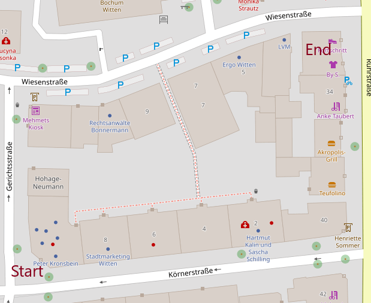

# AirSimGeo

This module gives AirSim the ability to reason about arbitrary projection systems that your simulation environment may be in. AirSim works with NED by default, however this plugin allows
you to work within any projected coordinate system that [pyproj](https://github.com/jswhit/pyproj) can handle. To learn more about projections and why the are useful, I encourage you to read [this](http://desktop.arcgis.com/en/arcmap/10.3/guide-books/map-projections/what-are-map-projections.htm#GUID-57EBA564-3106-4CD0-94AB-FA43C1320523).

Example of a small block in Witen, Germany built in the Unreal Engine. The simulation environment is a georeferenced world built from OSM in the UTM32N projected coordinate system. Watch as I command the quadrotor to land on a building by a GPS position. It knows where this GPS position is in the Unreal Engine.


Here is the map for reference:




## Install
Until the project is on PyPI you must clone and install.

1. `git clone https://github.com/JeremyBYU/airsimgeo.git`
2. `cd airsimgeo`
3. `pip install -e .`

If you are on windows you should use conda to install pyproj first - `conda install pyproj`


## Documentation

You may be running a simulation such that it is based upon a real world environment. In such a case you may be working with data sources that rely upon spherical (e.g. GPS; [lat,lon]) and local projected coordinate system (e.g. Mercator; [x,y]). Example data sources could be map, LiDAR, and elevation data. Your simulation environment (e.g. Unreal) may have terrain and buildings which are also in this same local projected coordinate system. 

Unfortunately AirSim only understands a local NED coordinate system. This means that the GPS to NED to Unreal Coordinate System conversion is most likely not compatible with your environment or data. This module resolves this issue.

AirSimGeo client extends AirSim's "MultirotorClient", so you have full access to all of airsim's method.
The three additional methods this module provides are:

1. getGpsLocation
2. moveToPositionAsyncGeo
3. moveOnPathAsyncGeo

You can use the module as so:

```python
import time
from airsimgeo import AirSimGeoClient
srid = 'EPSG:5555'
origin = (7.33577, 51.43672, 0.0)

client = AirSimGeoClient(srid=srid, origin=origin)
client.confirmConnection()

pos = client.getGpsLocation()
print("{:.4f},{:.4f},{:.4f}".format(pos[0], pos[1], pos[2]))

# Move to GPS position
client.moveToPositionAsyncGeo(gps=(7.3371,51.4374, 15)
```


### Coordinate Transform

This module basically works by converting from/to AirSims NED coordinate system. For the following examples we assume that the simulation environment is in the projected coordinate system EPSG:5555 (basically UTM zone 32N ) that is *zeroed* at the origin (7.33577, 51.43672, 0.0). Meaning Unreals (0,0,0) position is at (7.33577, 51.43672, 0.0).

First the module uses Pyproj to get the *projected* coordinate system offset from the origin given
```python
self.proj = Proj(init=srid)
self.origin_proj = self.proj(*self.origin[0:2]) + (self.origin[2],)
```

This will set `self.origin_proj=(384324.94, 5699705.39, 0)`. This means that `(0.0,0.0,0.0)` in the Unreal Coordinate System is actually `(384324.94, 5699705.39, 0)` in UTM 32N which is `(7.33577, 51.43672, 0.0)` in GPS coordinates.

This formula is used to convert from NED to the projected coordinate system. Note that the y and z axis is inverted. Z axis is inverted because NED goes *down*, y-axis is inverted because Unreal does not have a right hand coordinate system.
```
x_proj = x_ned + self.origin_proj[0]
y_proj = -y_ned + self.origin_proj[1]
z_proj = -z_ned + self.origin_proj[2]
```

Once in the projected coordinate system we can use PyProj to convert to GPS.


